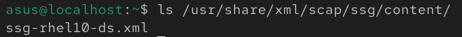

# Automated RHEL 10 Hardening with OpenSCAP & Ansible

## 1. Introduction

This lab demonstrates an Automated Compliance as Code workflow. The objective is to audit and harden a **Red Hat Enterprise Linux 10** workstation against the **CIS Benchmark**.

* **OS:** RHEL 10
* **Tools:** OpenSCAP (`oscap`), Ansible
* **Target Profile:** CIS Workstation Level 1

## 2. Setup & Installation

Install the required packages for scanning and automation:

```bash
sudo dnf -y install scap-security-guide ansible-core
```

Locate the SCAP Source Data Stream (Security Guide) for the device:

```bash
ls /usr/share/xml/scap/ssg/content/
```

The identified file is `ssg-rhel10-ds.xml`



Define the SCAP content path as an environment variable for easier reference:

```bash
export SCAP_CONTENT=/usr/share/xml/scap/ssg/content/ssg-rhel10-ds.xml
```

## 3. Execution

### Step 1: Scan System Audit

To view the list of available profiles, run:

```bash
oscap info $SCAP_CONTENT
```


I selected **CIS Workstation Level 1** profile (`xccdf_org.ssgproject.content_profile_cis_workstation_l1`) to ensure GUI compatibility while maintaining a strong security posture.

**Command:**

```bash
sudo oscap xccdf eval --profile xccdf_org.ssgproject.content_profile_cis_workstation_l1 --results scan-results.xml --report report.html $SCAP_CONTENT
```


This command generated `scan-results.xml` and `report.html`.


Open scan-results.xml in Browser


**Result:** The scan returned compliance score of **77.8%**. The report highlighted several misconfigurations that required remediation.

### Step 2: Generating Remediation

Using OpenSCAP, an Ansible Playbook was generated to automatically remediate the failed rules:

```bash
sudo oscap xccdf generate fix --profile xccdf_org.ssgproject.content_profile_cis_workstation_l1  --fix-type ansible $SCAP_CONTENT > ansible_hardening.yml
```

This command generated the `ansible_hardening.yml` file, which is an Ansible playbook containing automated remediation tasks.

### Step 3: Troubleshooting Ansible Dependencies

An attempt was made to execute the hardening playbook:

```bash
sudo ansible-playbook -i localhost, -c local ansible_hardening.yml
```

**Issue:**
During the playbook execution, Ansible failed with errors indicating missing modules (`community.general`, `ansible.posix`). This occurred because `ansible-core` provides only a minimal installation without additional collections.


**Resolution:**
The required collections were installed using `ansible-galaxy`:

```bash
sudo ansible-galaxy collection install ansible.posix community.general ansible.netcommon community.crypto
```

### Step 4: Applying Hardening

With dependencies resolved, the hardening playbook was executed successfully:

```bash
sudo ansible-playbook -i localhost, -c local ansible_hardening.yml
```


### Step 5: Verification

A post-remediation scan was executed to verify compliance:

```bash
sudo oscap xccdf eval --profile xccdf_org.ssgproject.content_profile_cis_workstation_l1 --results scan-results-after.xml --report report-after.html $SCAP_CONTENT
```

**Result:** The system successfully passed the compliance checks, achieving a score of **98.2%** and nearly full compliance with the CIS Workstation Level 1 profile. The automated remediation significantly improved the security posture of the RHEL 10 workstation.


## 4. Conclusion

This lab successfully demonstrated the effectiveness of **Compliance as Code** using OpenSCAP and Ansible. The compliance score improved from **77.8%** to **98.2%** through automated remediation, demonstrating the efficiency of Compliance-as-Code approaches to security hardening.

## 5. References

* [ComplianceAsCode Documentation](https://complianceascode.readthedocs.io/en/latest/manual/user/10_install.html)
* [CIS Benchmark](https://www.cisecurity.org/cis-benchmarks)
